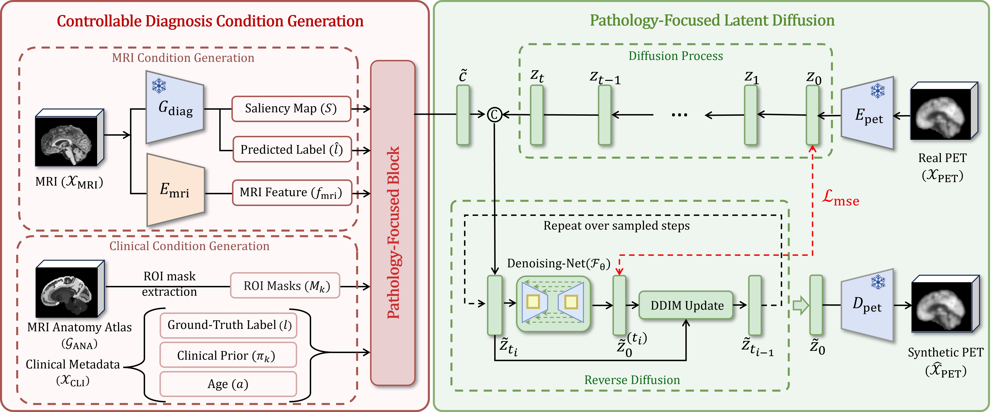

# PathLD: Pathology-Focused Latent Diffusion for Brain MRI-to-PET Synthesis

[](LICENSE)
[]()

<p align="center">
  
</p>

<p align="center">
  Official PyTorch implementation of <b>PathLD</b> for brain MRI-to-PET synthesis.
</p>

---

## Contents

- [Environment](#environment)
- [Repository Structure](#repository-structure)
- [Data Preparation](#data-preparation)
- [Configuration](#configuration)
- [Training](#training)
- [Inference and Evaluation](#inference-and-evaluation)
- [Results](#results)
- [Citation](#citation)
- [Contact](#contact)

---

## Environment

We recommend using Python 3.10 with a clean conda environment.

```bash
conda create -n pathld python=3.10 -y
conda activate pathld
pip install -r requirements.txt

## Repository Structure

```text
PathLD/
├── datas/
│   └── FDG/                            # MRI/PET data and PET latent codes
├── dataset/                            # Dataset definition
├── model/                              # Model components
├── scheduler/                          # Diffusion scheduler
├── utils/                              # Configuration and utility functions
├── result/                             # Checkpoints, logs, and generated results
├── train_aae.py                        # Train PET autoencoder / encode PET latents
├── train_diagnosis_guidance.py         # Train MRI diagnosis guidance network
├── train_multimodal_diagnosis.py       # Train multimodal diagnosis network
├── train_pathld.py                     # Train PathLD
├── test_pathld.py                      # Inference and evaluation
├── requirements.txt
└── README.md
```

## Data Preparation

### Dataset

Experiments are conducted on the **ADNI** dataset. You need to apply for access and download the required MRI and FDG-PET data from the ADNI website.

### Expected data layout

Please organize the data under `datas/FDG/` before training:

```text
datas/
├── atlas_masks/
└── FDG/
    ├── MRI/
    │   ├── train/
    │   ├── val/
    │   ├── test/
    │   └── FDG_train_MRI_info.csv
    └── PET/
        ├── train/
        ├── val/
        ├── test/
        └── latent_FDG/
```

The metadata CSV should contain the information required by the codebase, such as subject identifiers, diagnosis labels, and age.

### ROI mask preparation

python utils/atlas_split.py \
  --input ./datas/HarvardOxford-sub-maxprob-thr0-1mm_aligned.nii.gz \
  --output ./datas/atlas_masks/

## Environment Setup

We recommend using a dedicated conda environment.

```bash
conda create -n pathld python=3.10 -y
conda activate pathld
pip install -r requirements.txt
```

Before running any script, please check `utils/config.py` and update the following items according to your environment:

- dataset paths
- CSV file paths
- output directories
- batch size and GPU settings
- training phase for the autoencoder

## Training Pipeline

The training process consists of auxiliary pretraining followed by the main latent diffusion training.

### Step 1: Train the PET autoencoder

```bash
# set phase = "train" in utils/config.py
torchrun --nproc_per_node=<num_gpus> train_aae.py
```

### Step 2: Encode PET images into latent space

```bash
# set phase = "encoding" in utils/config.py
torchrun --nproc_per_node=<num_gpus> train_aae.py
```

This step generates PET latent representations used by the diffusion model.

### Step 3: Train the MRI diagnosis guidance network

```bash
torchrun --nproc_per_node=<num_gpus> train_diagnosis_guidance.py
```


### Step 4: Train the multimodal perceptual network

```bash
torchrun --nproc_per_node=<num_gpus> train_multimodal_diagnosis.py
```

### Step 5: Train PathLD

```bash
torchrun --nproc_per_node=<num_gpus> train_pathld.py
```

## Inference and Evaluation

After training, run inference and metric evaluation on the test set:

```bash
torchrun --nproc_per_node=<num_gpus> test_pathld.py
```

Predictions and quantitative results will be saved under the corresponding folder in `result/`.

## Notes

- This repository currently keeps the original project layout and script names for compatibility.
- If you are preparing a public release, it is recommended to further clean the codebase by unifying method naming, simplifying the directory layout, and removing temporary experimental outputs from version control.
- If you use this repository for your paper release, please make sure the method name in the README, manuscript, and citation entry is fully consistent.

## Citation

If you use this code in your research, please cite your paper here after publication:

```bibtex
@article{pathld2026,
  title   = {PathLD: Pathology-Focused Latent Diffusion for Brain MRI-to-PET Synthesis},
  author  = {Author One and Author Two and Author Three},
  journal = {xxx},
  year    = {2026}
}
```

## Contact

For questions about the code, please open an issue or contact the corresponding author.

## License

This project is released under the MIT License.
